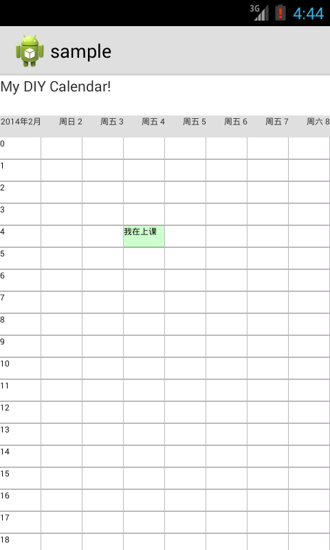

DateTime-Widget

## Demo
目前界面如下图



### 创建方法
* 动态生成:activity中调用 CalendarBuilder.builer(this),返回一个calendar view
* 在xml中使用:<include layout="@layout/scroll_week"/>

### 设定事件
````
Calendar cal1 = Calendar.getInstance(TimeZone.getTimeZone("Asia/Shanghai"));
DateTimeWeek week = CalendarBuilder.builder(this);
ArrayList<EvenBundle> evenList = new ArrayList<EvenBundle>();
evenList.add(new EvenBundle(cal1, new CellEven(3,4,5,"我在上课")));
week.setEvenList(1,evenList);
````
